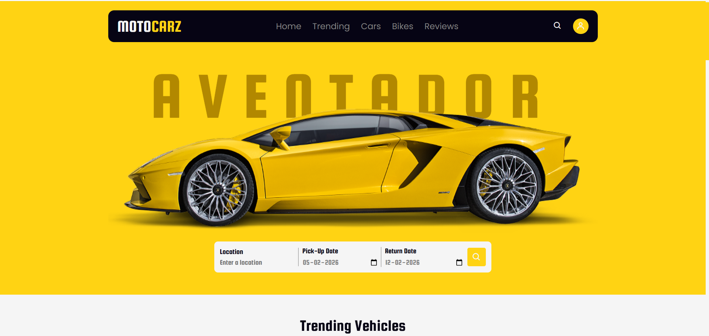
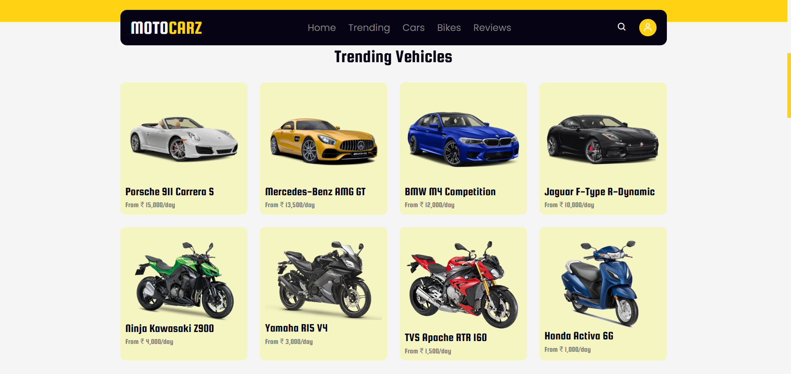

# Motocarz

Motocarz is a clean, responsive, and visually appealing car showcase website built using HTML, CSS, and JavaScript.  
It provides a smooth browsing experience across all devices with a modern layout and simple navigation.

**Live Demo:** [View Website](https://shyamkumarnagilla.github.io/MotoCarz/)

---

## Screenshots

### Home Page



### Trending Section


---

## Features

- Fully responsive design for all screen sizes  
- Modern and elegant user interface  
- Multi-device compatible and lightweight  
- Organized layout for easy navigation  

---

## Technologies Used

- HTML  
- CSS  
- JavaScript  

---

## Project Structure

```bash
Motocarz/
├── index.html
├── style.css
├── script.js
└── images/
```

---

## Developer

Developed by   **Shyam Kumar Nagilla** 

- GitHub: https://github.com/Shyamkumarnagilla
- LinkedIn: https://www.linkedin.com/in/nagilla-shyam
- Email: nagillashyamkumar7@gmail.com

---

*If you like this project, give it a star to support the work!*
